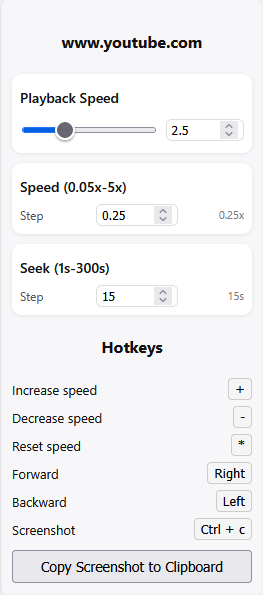

<h2>Firefox <i>desktop-only</i> browser extension for basic HTML5 video control</h2>

<a href=https://addons.mozilla.org/en-US/firefox/addon/videocontrol><h2>Install extension here</h2></a>

## Features

- HTML5 video playback speed control
  - speed multipliers range from 0.05x to 128x
  - can modify speed value individually for each video
  - stores latest value separately for each site
    - if you open a new video on same site e.g. Youtube, it uses this shared value as default
    - each site tracks it's own speed state -> Youtube and Twitch speed stays separated
- customize step lengths for seeking and speed (defaults are 5s and 0.25x respectively)
- take screenshot from current video frame and copy it to clipboard
- simple popup UI where you can customize settings and hotkeys.
  - hovering mouse over labels displays a short info string for each
- small overlay on top-left corner of video to briefly display speed updates and screenshot capturing

## Permissions

This extension requires following permissions from user:

- `storage` -> allow use of browser local storage to store and retrieve website-specific speed values + global
  seek/speed steps and hotkeys.
- `clipboardWrite` -> allow taking screenshots from current tab's main video and copy them to clipboard
- `tabs` -> required for continuous synchronization between UI and content script.
  In particular
  - **tabs.query** is used for easily identifying active browser tab in the current window
  - **tabs.sendmessage** allows communication with content script (control.js) inside the current tab. Because UI and
    script code lives separately, they can realistically only communicate through messages or local storage changes.
    Messages are used because they
    1. are faster
    2. provide feedback to UI when needed (request-response)
    3. ensure content scripts are executed in correct tab context

  Exact use cases:
  - retrieve and apply playback speed for the active tab
    - this enforces same speed value between videos e.g, when using a Youtube playlist, auto-apply latest state onto
      next video
  - maintain site-specific speed settings using hostname as identifier
  - synchronize UI with active video tab: updates domain name and speed slider/input fields
  - send messages to call scripts and perform speed change, step forward/backward or take a screenshot.

    > For these reasons, **"tabs" is used over "activeTab"**. As "activeTab" only allows temporary access after user's
    > action, it won't allow sending queries or performing data synchronizations autonomously in the background which
    > this extension relies on.
    >
    > In conclusion:
    >
    > - "tabs" permission is only used to create a fluid interface between UI and active browser tab
    > - browsing history is not collected or stored
    > - data from inactive tabs is not accessed
    > - any data processing in active tab is done locally inside user's browser. This extension will not collect, store or transmit it to third-party entities.

## Issues

If you have any questions or bugs, please report them by creating a new issue.

Current:

- code uses key string values instead of keycodes. This could cause conflicts on different keyboard layouts
- when updating hotkeys, arrow keys seem to sometimes just break and refuse to register. Haven't had this happen with
  other keys, however
